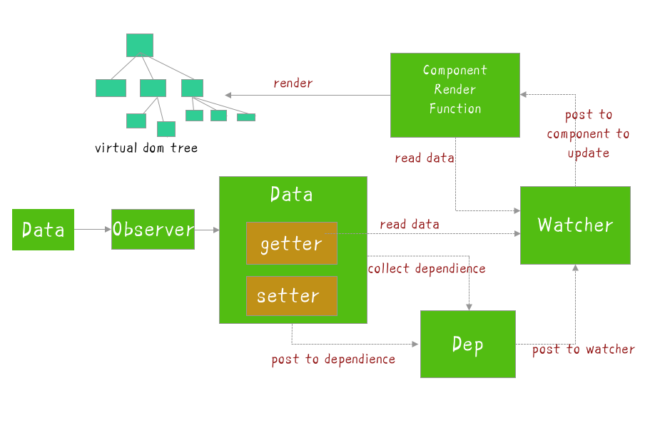
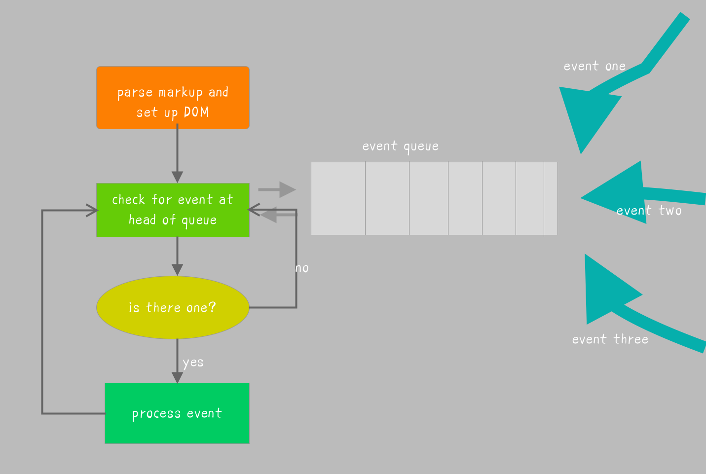
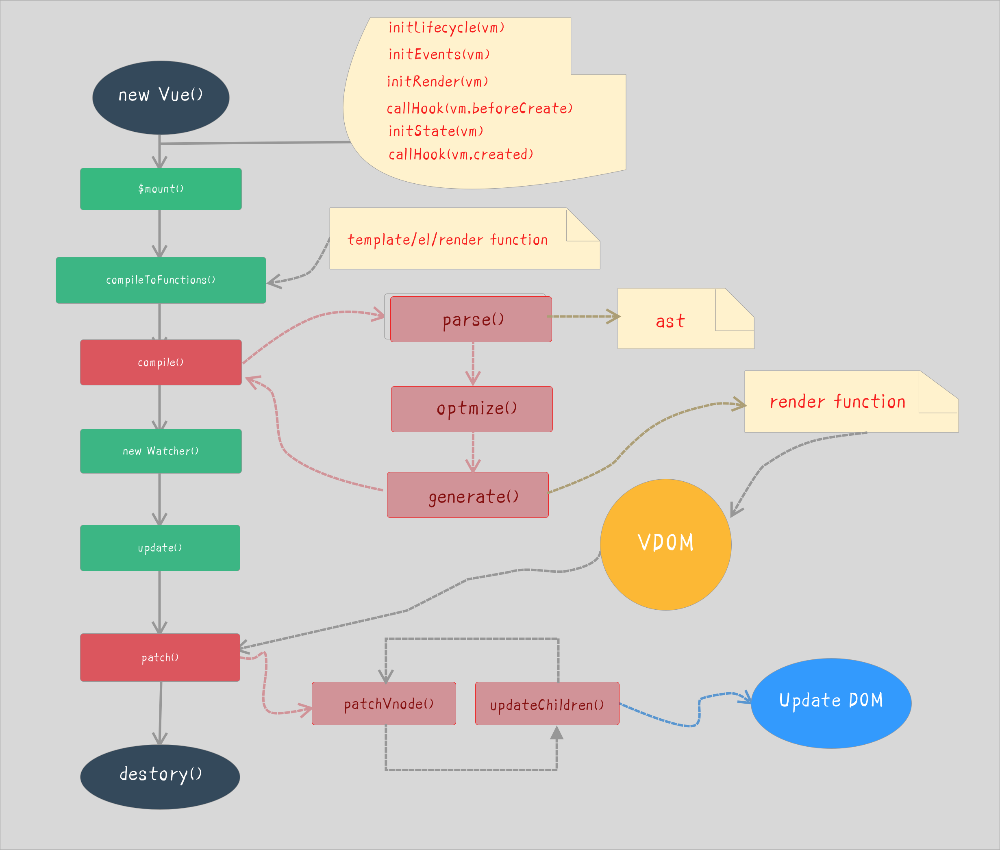

## js interview guide


### Vue

[1]. Vue reactive principle



#### Observer:

Add getter and setter to the properties of the object for dependency collection and distribution updates

#### Dep:

Collect the dependencies of the current reactive object. Each reactive object including sub-objects has a Dep instance (where subs is an array of Watcher instances). When the data changes, each watcher will be notified through `dep.notify()`.

#### Watcher

Instances are divided into three types: rendering watcher (render watcher), calculated attribute watcher (computed watcher), and listener watcher (user watcher)

#### The relationship between `Watcher` and `Dep`

The watcher instantiates dep and adds subscribers to dep.subs. Dep traverses dep.subs through notify to notify each watcher of updates.


#### Dependent collection

In initState, when the computed attribute is initialized, the computed watcher dependency collection is triggered
In `initState`, when the listening attribute is initialized, the user watcher dependency collection is triggered
The process of `render()` triggers the render watcher dependency collection
During re-render, `vm.render()` is executed again, which will remove the subscription of watcer in all subs and re-assign the value.

#### Distribute updates

The response data is modified in the component to trigger the logic of the setter

#### Call `dep.notify()`

Traverse all subs (Watcher instances) and call the update method of each watcher.

#### principle
When a Vue instance is created, Vue will traverse the properties of the data option, use `Object.defineProperty` to add `getters` and `setters` to the properties to hijack the reading of the data (`getters` are used for dependency collection, `setters` are used to distribute updates), and internally track dependencies , Notify changes when properties are accessed and modified.

Each component instance will have a corresponding watcher instance, which will record all dependent data attributes (dependency collection, computed watcher, user watcher instances) during component rendering, and then the setter method will notify when the dependency is changed The watcher instance that relies on this data is recalculated (distributed updates), so that its associated components are re-rendered.


[2]. The realization principle of `computed`:


The essence of computed is a lazily evaluated observer.

A lazy watcher is implemented inside computed, that is, computed watcher. The computed watcher will not be evaluated immediately and will hold a dep instance.

It uses `this.dirty` property to mark whether the calculated property needs to be re-evaluated.

When the dependent state of computed changes, this lazy watcher will be notified,

The computed watcher uses `this.dep.subs.length` to determine whether there are subscribers,

If there is, it will be recalculated and then compared with the old and new values. If it changes, it will be re-rendered. (Vue wants to ensure that not only the value that the calculated attribute depends on changes, but also that the rendering watcher is triggered to re-render when the final calculated value of the calculated attribute changes, which is essentially an optimization.)

If not, just set `this.dirty = true`. (When the calculated attribute depends on other data, the attribute will not be recalculated immediately. It will only be calculated when the attribute needs to be read elsewhere, that is, it has the characteristics of lazy (lazy calculation).)


[3]. What is the difference between `computed` and `watch` and application scenarios?


the difference computed attribute: depends on other attribute values, and the computed value is cached. Only when the attribute value it depends on changes, the computed value will be recalculated the next time the computed value is obtained.

Watch listener: It is more about the function of "observation", no cache, similar to the monitoring callback of some data, whenever the monitored data changes, the callback will be executed for subsequent operations.

Application scenario
Application scenarios:

When we need to perform numerical calculations and rely on other data, we should use computed, because we can use the cache feature of computed to avoid recalculation every time we get a value.

When we need to perform asynchronous or expensive operations when data changes, we should use watch. Using the watch option allows us to perform asynchronous operations (accessing an API), limiting the frequency with which we perform the operation, and before we get the final result ,Set the intermediate state. These are things that calculated properties cannot do.


[4]. Why is Proxy adopted in Vue3.0 and `Object.defineProperty` is abandoned?


`Object.defineProperty` itself has a certain ability to monitor the changes of array subscripts, but in Vue, considering the performance/experience cost-effectiveness, this feature is greatly abandoned (why can Vue not detect array changes). In order to solve this problem, the following methods can be used to monitor the array after internal processing in vue

```js
push();

pop();

shift();

unshift();

splice();

sort();

reverse();
```


Since only the above 7 methods have been hacked, the attributes of other arrays are also undetectable, and they still have certain limitations.

`Object.defineProperty` can only hijack the properties of the object, so we need to traverse each property of each object. In Vue 2.x, data is monitored through recursion + traversal of data objects. If the attribute value is also an object, then deep traversal is required. Obviously, it is better to hijack a complete object.
`Proxy` can hijack the entire object and return a new object. `Proxy` can not only proxy objects, but also proxy arrays. It can also proxy dynamically added attributes.


[5]. What is the use of `keys` in Vue?

The key is the unique id for each vnode. Depending on the key, our diff operation can be more accurate and faster (for simple list page rendering, the diff node is also faster, but it will produce some hidden side effects, such as may not Transition effects, or the state of binding data (form) at some nodes, will cause state dislocation.)

In the process of the diff algorithm, the new and old nodes will be cross-compared first.

More accurate: Because the key is not reused in place, in the sameNode function a.key === b.key comparison can avoid in-situ reuse. So it will be more accurate. If the key is not added, the state of the previous node will be retained, which will cause a series of bugs.

Faster: The uniqueness of the key can be fully utilized by the Map data structure. Compared with the time complexity of traversal search O(n), the time complexity of Map is only O(1). The source code is as follows:


[code](./vue/05.js)


[6]. Talk about the principle of `nextTick`

#### JS operating mechanism

JS execution is single-threaded, and it is based on an event loop. The event loop is roughly divided into the following steps:

All synchronization tasks are executed on the main thread, forming an execution context stack.
In addition to the main thread, there is also a "`task queue`" (task queue). As long as the asynchronous task has a running result, an event is placed in the "task queue".
Once all the synchronization tasks in the "execution stack" are executed, the system will read the "task queue" to see what events are in it. Those corresponding asynchronous tasks end the waiting state, enter the execution stack, and start execution.
The main thread keeps repeating the third step above.




The execution process of the main thread is a tick, and all asynchronous results are scheduled through the "task queue". What is stored in the message queue is a task. The specification stipulates that tasks are divided into two categories, `macro` tasks and `micro` tasks, and after each macro task ends, all micro tasks must be cleared.


In the browser environment:

Common macro tasks include `setTimeout`, `MessageChannel`, `postMessage`, `setImmediate`

Common micro tasks include `MutationObsever` and `Promise.then`

#### Asynchronous update queue

You may not have noticed that Vue is executed asynchronously when updating the `DOM`. As long as it listens to data changes, Vue will open a queue and buffer all data changes that occur in the same event loop.

If the same watcher is triggered multiple times, it will only be pushed to the queue once. This removal of duplicate data during buffering is very important to avoid unnecessary calculations and DOM operations.

Then, in the next event loop "`tick`", `Vue` refreshes the queue and executes the actual (deduplicated) work.

`Vue` internally tries to use native `Promise.then`, `MutationObserver` and `setImmediate` for asynchronous queues. If the execution environment does not support it, it will use `setTimeout(fn, 0)` instead

In the source code of vue2.5, the macrotask downgrade scheme is: `setImmediate`, `MessageChannel`, `setTimeout`

The realization principle of vue's `nextTick` method:

Vue uses asynchronous queues to control `DOM` updates and `nextTick` callbacks.
Because of its high-priority feature, microtask can ensure that the microtasks in the queue are executed before an event loop
Considering compatibility issues, vue made a downgrade scheme from microtask to macrotask

[7]. How does vue `mutate` array methods?

Let's take a look at the source code first

[code](./vue/07.js)

Simply put, Vue rewrites the 7 methods of the array through prototype interception. First, it gets the ob of this array, which is its `Observer` object. If there is a new value, it calls `observeArray` to monitor the new value. Then manually call `notify`, `notify` the render watcher, and execute update


[8]. Why must the Vue component data be a function?

In the new `Vue()` instance, data can be directly an object. Why in the vue component, data must be a function?
Because components can be reused, objects in `JS` are referenced. If the component data is an object, then the data attribute values ​​in the sub-components will pollute each other and cause side effects.

So the data option of a component must be a function, so each instance can maintain an independent copy of the returned object. Instances of new Vue will not be reused, so there is no such problem.


[9]. Talk about the Vue event mechanism, handwriting `$on`, `$off`, `$emit`, `$once`


> The Vue event mechanism is essentially an implementation of a publish-subscribe model.

[10]. Talk about the Vue render process.


Call the `compile` function to generate the render function string. The compilation process is as follows:

The `parse` function parses the template and generates `ast` (abstract syntax tree)

The `optimize` function optimizes static nodes (marking content that does not need to be updated every time, the diff algorithm will directly skip the static nodes, thereby reducing the comparison process and optimizing the performance of the patch)

The `generate` function generates the render function string

Call the new `Watcher` function to monitor the changes in the data. When the data changes, the Render function executes to generate a `vnode` object

Call the `patch` method, compare the old and new `vnode` objects, and add, modify, and delete real DOM elements through the DOM diff algorithm




[11]. Talk about the implementation principle and caching strategy of keep-alive:


[code](./vue/keep-alive.vue)


### Principle 

Get the first sub-component object and its component name wrapped by keep-alive. 
Condition matching is performed according to the set include/exclude (if any),
 and it is decided whether to cache. 
If there is no match, return the component instance directly.
 Generate a cache Key based on the component ID and tag,
and find whether the component instance has been cached in the cache object. 
If it exists, directly take out the cached value and update the position of 
the key in this.keys .
(update the key position is the key to realize the LRU replacement strategy) 
Store the component instance in this.cache object and save the key value,
and then check the cache .
Whether the number of instances exceeds the set value of `max`,
if it exceeds, the least recently used instance (that is, the key with subscript 0)
will be deleted according to the `LRU` replacement strategy.
Finally, the keepAlive property of the component instance is set to true, 
which is wrapped in rendering and execution .
The hook function of the component will be used, not detailed here.

The implementation of keep-alive uses the `LRU` strategy to 
push the recently accessed component to the end of this.keys, 
`this.keys[0]` is the component that has not been accessed for the longest time.
 When the cache instance exceeds the max setting value, 
 delete `this.keys[0]`
 
 
[12]. What is the principle of implementing `vm.$set()`? 

Due to the limitations of modern JavaScript (and `Object.observe` has also been deprecated), Vue cannot detect the addition or deletion of object properties. 
Since `Vue` will perform `getter/setter` conversion on the property when initializing the instance, the property must exist on the data object in order for Vue to convert it to reactive. 
For already created instances, `Vue` does not allow dynamic addition of root-level reactive properties. 
However, you can use the `Vue.set(object, propertyName, value)` method to add responsive properties to nested objects. 
So how does `Vue` internally solve the problem that the new properties of the object cannot respond?


[code](./vue/12.ts)


### JS

[13] . Realize shallow copy and deep copy

[code](./vue/13.js)

[14] . think about `setTimeout()`

[code](./vue/14.js)

[15] . parseInt and map()

[code](./vue/15.js)

[16] .  What is anti-shake and throttling?  What's the difference? How to achieve?


1) Anti-shake function will only be executed once within n seconds after triggering the high-frequency event. If the high-frequency event is triggered again within n seconds, the time will be recalculated;

[code](./vue/16.js)

[17] . Introduce the difference between `Set`, `Map`, `WeakSet` and `WeakMap`?

1) `Set` members are unique, unordered, and non-repetitive; `[value, value]`, 
the key value is consistent with the key name (or only the key value, no key name); 
It can be traversed, the methods are: `add`, `delete`, `has`. 
2) The members of `WeakSet` are all objects; 
the members are all weak references, which can be recycled by garbage collection mechanism, 
and can be used to save `DOM` nodes, which are not easy to cause memory leaks; 
they cannot be traversed. The methods include `add`, `delete`, and `has`. 
3) `Map` is essentially a collection of key-value pairs, similar to a collection; it can be traversed, with many methods, and can be converted with various data formats. 
4) `WeakMap` only accepts the object as the key name (except null), and does not accept other types of values ​​as the key name; 
the key name is a weak reference, the key value can be arbitrary, and the object pointed to by the key name can be garbage collected. 
The name is invalid; it cannot be traversed. The methods are `get`, `set`, `has`, and `delete`.


[18] . Handwriting EventEmitter

[code](./vue/18.js)


